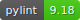

[Back to main](../README.md)

# ATBA - Routine

ATBA stands for "At The Ball Always". This means that the bot will always try to steer for the ball

|   |   |
|---|---|
| 3.10    	| 
| 3.11    	| 
| 3.12    	| 

## State machine

## Explanation

The bot can only be in 2 states:
- Going towards the ball
- Going away from the ball

If it tries to go for the ball while already going for the ball, nothing changes, same for the other state.
The existence of a "neutral" action is to create a clear distinction (for me) between the model mistaking going for ball when already going for ball or actually choosing to stay on the ball. For it to be relevant, i'd need to "punish" switching the actions of going to ball / away from ball, so that it chooses and keeps its decision for a while. This is not the case for now. For the bot, using neutral or going for ball while already going for the ball is the exact same result.

See [Changelog](CHANGELOG.md)

[Back to top](#atba---routine)